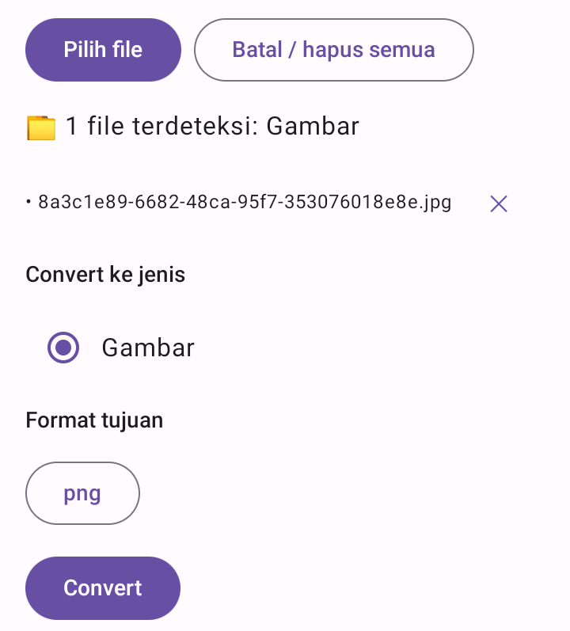
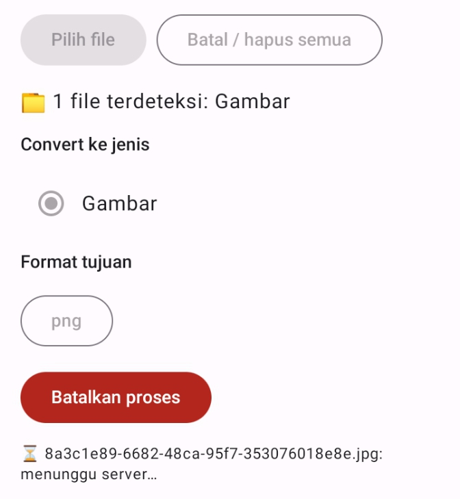
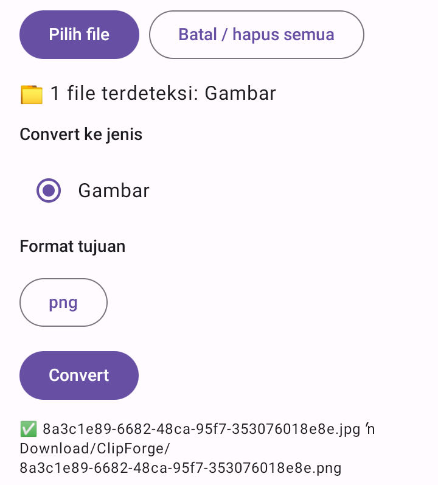
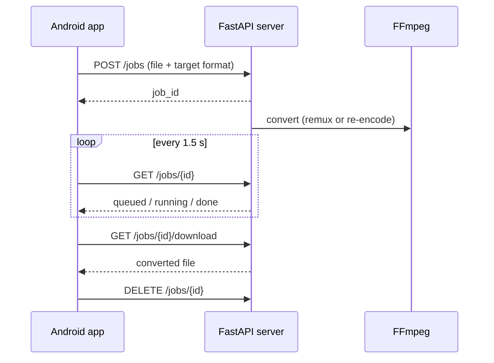

# ClipForge

An Android media toolkit built with Kotlin and Jetpack Compose, backed by a Python (FastAPI + FFmpeg) server.
The first module is a **universal media converter** for video, audio, and images. AI-powered tools (subtitles, voice enhancement, audio separation, and more) are planned next.

<p align="center">
  
  
  
</p>

## Features (v0.2)

- Converts **29 formats**: 12 video, 10 audio, and 7 image formats
- **Smart format picker**: the choices depend on what you select
  - video can become video or audio
  - audio can only become audio
  - images can only become images
  - the source format is never offered as a target
- **Batch conversion**, one file at a time, with upload progress and per-file status
- **Cancel that really cancels**: stopping a conversion also kills the FFmpeg process on the server
- **Keeps running in the background** through a foreground service, with a notification when finished
- Results are saved to `Download/ClipForge`
- Works on **32-bit Android devices** (min SDK 24), because the app ships no native libraries

## Architecture



| Part | Tech |
|---|---|
| Android app | Kotlin, Jetpack Compose (Material 3), coroutines, `HttpURLConnection` |
| Server | Python, FastAPI, Uvicorn, FFmpeg |
| CI | GitHub Actions builds the APK on every push |

### Server API

| Method | Path | Purpose |
|---|---|---|
| GET | `/health` | Liveness check |
| POST | `/jobs` | Upload a file and a target format, returns `job_id` |
| GET | `/jobs/{id}` | Job status: `queued`, `running`, `done`, `error`, `cancelled` |
| GET | `/jobs/{id}/download` | Download the result |
| DELETE | `/jobs/{id}` | Cancel (stops FFmpeg) and clean up |

All endpoints except `/health` require an `X-API-Key` header.

## Engineering notes

- **Remux instead of re-encode.** Converting an H.264 + AAC video between MP4, MKV, and MOV only needs a container change. Detecting this with `ffprobe` and copying the streams took a conversion from **488 s to about 1 s**, with no quality loss.
- **Why FFmpeg runs on a server.** The community FFmpeg builds for Android that fit an LGPL app ship no `libx264`, and the one I evaluated is arm64-only, which would exclude 32-bit phones. Moving FFmpeg server-side keeps all formats available on any device.
- **Asynchronous jobs.** Tunnels and proxies cut long requests, so the server uses a create, poll, download pattern instead of one long request.
- **Cancellation.** FFmpeg runs under `Popen` and polls a cancel flag, so a cancelled job stops the process instead of letting it finish in the background.
- **One codec table for every target format.** A startup check fails fast if any format offered in the UI has no codec settings.
- **Updatable debug builds.** The APK is signed with a fixed key restored from a GitHub secret during CI, so new builds install over old ones and keep app data.

## Project structure

```
app/src/main/java/com/clipforge/app/
├── MainActivity.kt      # UI and conversion flow
├── Formats.kt           # format lists and conversion rules
├── ServerSettings.kt    # server URL / API key / connection test
├── ServerClient.kt      # HTTP client (upload, poll, download)
├── Convert.kt           # per-file conversion pipeline
├── Storage.kt           # saving results to Downloads
├── KeepAliveService.kt  # foreground service
├── Notifier.kt          # completion notification
└── Prefs.kt             # stored settings
server/
├── server.py            # FastAPI app
├── core/                # config, codec table, FFmpeg helpers
└── tools/               # converter logic
```

## Getting started

**App:** download the APK from the latest successful run in the **Actions** tab (artifact `clipforge-debug`) and install it.

**Server (prototype setup):**

1. Run `server/` in a Python environment with FFmpeg installed (I used a Google Colab notebook with Google Drive mounted).
2. Install dependencies: `pip install fastapi uvicorn python-multipart`
3. Set the `API_KEY` environment variable and start `uvicorn server:app --port 8000`
4. Expose the port (I used a Cloudflare quick tunnel)
5. In the app, paste the server URL, enter the API key, and tap **Tes koneksi**

Paths in `server/core/config.py` assume the Colab + Drive layout and need adjusting elsewhere.

## Limitations

- The prototype backend runs on a Colab notebook behind a temporary tunnel, so the URL changes each session and must be pasted into the app. Colab is intended for interactive use, so this setup is for development and demos only. The server is a standalone service and can be moved to a VPS or container.
- The app blocks files over 100 MB as a safeguard. That limit is a conservative guess for the tunnel, not a measured value.
- The Android 9 and lower fallback saves results inside the app's own folder.

## Roadmap

- [x] Media converter
- [ ] Subtitle generator (Whisper)
- [ ] Voice enhancer
- [ ] Audio separator (vocals / music)
- [ ] Epic moment finder
- [ ] Voice cloning and Indonesian TTS

## License

MIT